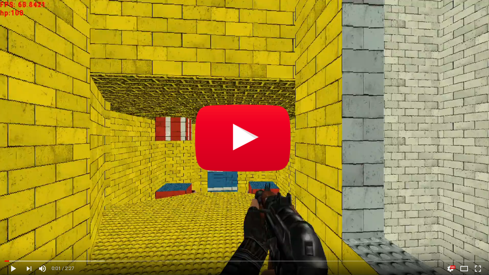

Toom Rendering Engine
=========

Partial remake of the original Doom 1. Written as an assignment during a programming course. Uses doom-like rendering, it means that everything is drawn using one pixel wide stripes (better said by drawing one pixel wide rectangles using OpenGL).

The code is based on the [Doom Wiki](http://doomwiki.org) and on the great [videos of Mr. Bisqwit](https://www.youtube.com/watch?v=HQYsFshbkYw). The program is of course not so pretty and effective as the original Doom, but it works.

## Features

* Doom 1 datastructures like `Sectors`, `Subsectors`, `Planes`, ...
* BSP tree (for getting the proper order of walls for drawing).
* Block Map (for faster collision detection).
* Static and moving sprites rendering (this has bugs unfortunately).
* Animated sprite textures based on its orientation.
* Floors & ceiling texture mapping.
* Wall texture mapping.
* Wall texture alignment.
* Doors (also textured).
* Pass-through walls (like a curtain).
* Partialy transparent walls (like a jail grid).
* Player jumping and crawling.
* Collision detection.

## Missing features

* Rendering of the sky.
* Lighting effects.
* Pickable items.
* Blood.

## Gameplay video

## Compilation
Developed in **Visual Studio** together with **MSVC**, event not tried to compile using gcc. The application depends on [SFML](https://www.sfml-dev.org/) libraries (handling of sound, user input and makes usage of OpenGL easier). Make sure that there are present `Sounds`, `Fonts` and `Maps` directories with the needed dependencies.

## Artificial dementia (AD) of enemies

Enemies are activated once they see the player (Line of Sight computation) or once the player enters their Sector. If the gun of an enemy can reach the player, the enemy is shooting or running away in a random direction with some probability. If the gun cannot reach the player, the enemy goes towards him. If the enemy hits a wall, he just turns and goes in another random direction.

## Map definition

*Note: The original Doom's WAD file cannot be used. I defined my own map format.*

See [an example](Maps/e1m1.map) and the parser's source code for better understanding.
